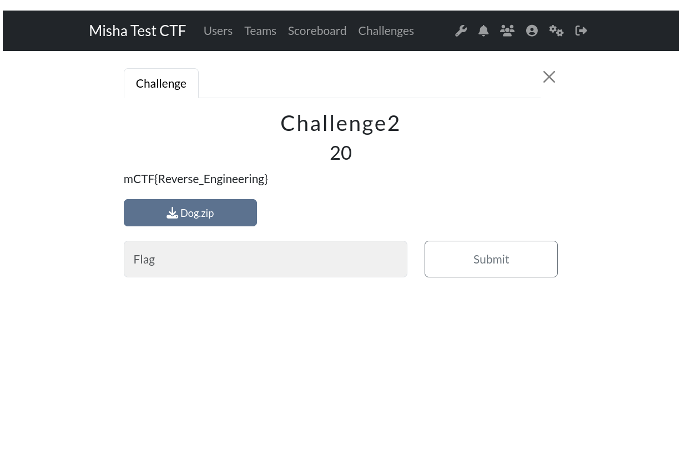

# 02-ctfd-intro

Include screenshots and textual outputs of EVERYTHING given below:
All reasonings must look non GPTish. Where not asked for, a sentence will suffice.

<h3>Go through every nook and corner of ctfd website. This includes but is not limited to their forums, github organisation</h3>

CTFd is a widely used CTF framework, that focuses on ease of use and customability. In addition to a thorough feature set, CTFd also has plugins and themes available for additional customability. It is written in Python and makes use of the Flask web framework.
<br><br>

<h3>Give a max-50 words cost analysis of their paid tier</h3>

Their paid tier consists of 3 plans:
- Basic: $50 (Rs. 4165) / month, unlimited users, custom domains, TLS/SSL, 250k monthly page views, 5 container services.
- Plus: $100 (Rs. 8330) / month, includes Basic plan features with 750k monthly page views, 10 container services, programming challenges, MCQs, Webhooks.
- Professional: $300 (Rs. 24990) / month, includes Plus plan features with 3M monthly page views, 30 container services, SAML Authentication, IP Address restrictions.
- Additional pricing for themes, plugins, and merch. 
<br><br>

<h3>After going through the docs and based on your current knowledge, do you think CTFd can be hosted for an audience of 10 players by:</h3>

<b>you alone:</b>

As of now, I understand the architecture of the hosted CTFs infrastructure. However, I don't necessarily completely understand the intricacies. Like, I have a rough idea on what servers I need, but I don't know how to program them, horizontal scaling, etc.

<b>PM alone:<br>
President of USA alone:</b>

To become the Prime Minister or President, you primarily need knowledge in the fields of politics and how the government functions. I don't think this covers the technical aspects of hosting a CTF, even for 10 players.

<b>you + friends:</b>

If my friends have the technical skills to host a CTF, then sure.

<b>PM + friends:<br>
President of USA + friends:</b>

If the PM's/President's friends know how to host a small scale CTF, then sure.
<br><br>

<h3>Re-answer the above question for 1000 player audience</h3>

<b>you alone:</b>

I'm assuming a 1000 player audience will require a load balancer, which again, I'm not entirely confident in hosting.

<b>The rest:</b>

Same as above.
<br><br>

<h3>Run the CTFd server locally using the **DOCKER IMAGE METHOD**</h3>

- i.e. `docker run ctfd/ctfd` something

Used `docker pull ctfd/ctfd` then `docker run ctfd/ctfd`

<p align = 'center'>


</p>

<p align = 'center'>


</p>

Tried accessing the frontend using http://0.0.0.0:8000, however that didn't work. Went through the github and saw the command `docker run -p 8000:8000 -it ctfd/ctfd` so that a request to the container on port 8000 will be forwarded to the application bound to port 8000 inside the container.

<p align = 'center'>


</p>

- Check if you are able to access the server frontend on the default port (everything's in the docs), if not fix your docker run command.

<p align = 'center'>


</p>
<br><br>

<h3>Permanently change the listening port of server to 4873 and use netcat to verify</h3>

- For this, you will have to clone the repo, edit a file, build the image again and then run ths server

Cloning repo:

<p align = 'center'>


</p>

Changing port on docker-compose.yml

<p align = 'center'>


</p>

Running docker:

<p align = 'center'>


</p>

Using nc to verify:

<p align = 'center'>


</p>

Frontend (http://0.0.0.0:4873)

<p align = 'center'>


</p>

<br><br>

<h3>Create 5 static challenges and set flags, points and descriptions, upload files for all of them</h3>

All Challenges:

<p align = 'center'>


</p>

Uploaded a zipped picture of a cat:

<p align = 'center'>


</p>

Uploaded a zipped picture of a dog:

<p align = 'center'>



</p>

Uploaded a python script:

<p align = 'center'>


</p>

Uploaded a 50MB zipped file:

<p align = 'center'>


</p>

Uploaded a 100MB zipped file:

<p align = 'center'>


</p>

<br><br>

<h3>Change CTF start end time, disable registrations and restrict the users and teams page to logged in users</h3>

Editted the start time to start from 27th October, 2024 12 am (couldn't find IST in the timezone list):

<p align = 'center'>


</p>

Editted the end time to end on 29th October, 2024 11:59 pm:

<p align = 'center'>


</p>

- Disabled registrations by changing Registration Visibility to Private.
- Restricted the users and teams page to logged in users: Did this by changing Account Visibility to Private. Doesn't really solve the task, as this changes visibility of user's and team's scores, solved questions, percentage of questions solved, etc. to be visible by registered users, and not logged in users. Couldn't find a closer approach online though.
- Putting Score Visibility to Private allows only logged in users can view the scores.

<p align = 'center'>


</p>

<br><br>

<h3>Change the text on the CTFd homepage to nitectf and add a "Rules" page on the navbar and populate it</h3>

<p align = 'center'>


</p>

<p align = 'center'>


</p>

<br><br>

<h3>Give reasoning on point decay value</h3>

Point decay is a mechanic employed in CTF challenges to accurately judge the difficulty of the challenge proportional to the number of solves. A challenge normally starts of at 500 points, and after every solve, the points go through mathematical changes to reflect the new points awarded for solving the challenge. Point decay primarily serves to award appropriate points for the difficulty level of the challenge.

<h3>Explain the two kinds of decays</h3>

I can't find particular names for the two kinds of decays. However,
- Decay1: Every challenge starts off at 500 points. The first team to solve a challenge gets those 500 points, but the point value decreases after the first solve, to say, 490 approximately. The next team to solve the challenge will receive 490 points, and so on.
- Decay2: Every challenge starts off at 500 points. Contrary to decay1, the decayed value of the points is reflected in the scores of the teams who solved the challenges as well. If a team solved the challenge for 500 points, and gradually the points decrease to 100, the team will receive 100 points for that solve.
<br><br>

<h3>What are CTFd plugins</h3>

CTFd plugins allow the modification of CTFd behaviour without modifying the core CTFd code. This allows you to share your modifications more easily, and also CTFd can be updated without losing any custom behaviour.
Different types of plugins include:
- Challenge Type Plugins: To modify the challenge type (self explanatory).
- Flag Type Plugins: To modify the flag to be submitted, so they don't conform to a hardcoded string.
<br><br>

---

<h3>Give an ELI13 on what is cloud</h3>

The cloud refers to a collection of special computers called servers, whose data and software can be accessed from anywhere in the world through the Internet. It's like having your own personal computer with a set amount of storage space, but instead, the cloud has almost infinite storage. The data you upload onto the cloud can be accessed from any device connected to the internet. This means you can get to your files, photos, and apps from any computer, phone, or tablet, no matter where you are.
<br><br>

<h3>Differentiate between regions and zones in any cloud service provider</h3>

The cloud consists of data centers in specific locations that contain the actual servers, storage equipment, etc. A CSP operates these data centers. To make them available worldwide, the cloud infrastructure is divided into regions, which is a combination of availability zones. Data stored in a region, stays in that region.<br>
Availability zones consist of one or more close data centers. These zones are independent from the other zones, i.e., the failure of any one zone will not cause the failure of the other zones.
<br><br>

<h3>List all the regions and zones of at least three major cloud service providers operating in India</h3>

- Azure has 64 regions with 15 under development.

| Regions                       | Zones    | 
| :------------------:          | :------: | 
| Central US                    | 3        | 
| East US                       | 3        | 
| East US 2                     | 3        | 
| East US 3                     | 3        | 
| North Central US              | 1        | 
| South Central US              | 3        | 
| West Central US               | 1        | 
| West US                       | 1        | 
| West US 2                     | 3        | 
| West US 3                     | 3        |
| US DoD Central                | 1        | 
| US DoD East                   | 1        |
| US Gov Arizona                | 1        |
| US Gov Texas                  | 1        |
| US Gov Virginia               | 3        |
| US Sec East                   | 1        |
| US Sec West                   | 1        |
| US Sec West Central           | 1        |
| Brazil South                  | 3        | 
| Brazil Southeast              | 1        |
| Canada Central                | 3        | 
| Canada East                   | 1        |
| Chile Central                 | 3        |
| Mexico Central                | 3        |
| Austria East                  | 3        |
| Belgium Central               | 1        |
| Denmark East                  | 3        |
| Finland Central               | 1        |
| France Central                | 1        | 
| France South                  | 3        | 
| Germany Central (Sovereign)   | 1        | 
| Germany North                 | 1        | 
| Germany Northeast (Sovereign) | 1        | 
| Germany West Central          | 3        | 
| Greece Central                | 3        | 
| North Europe                  | 3        | 
| Italy North                   | 3        | 
| West Europe                   | 3        |
| Norway East                   | 3        | 
| Norway West                   | 1        |
| Poland Central                | 3        |
| Spain Central                 | 3        |
| Sweden Central                | 3        |
| Sweden South                  | 1        |
| Switzerland North             | 3        |
| Switzerland West              | 1        |
| UK South                      | 3        | 
| UK West                       | 1        |
| Australia Central             | 1        | 
| Australia Central 2           | 1        |
| Australia East                | 3        |
| Australia Southeast           | 1        |
| China East                    | 1        |
| China East 2                  | 1        |
| China East 3                  | 1        |
| China North                   | 1        |
| China North 2	                | 1        | 
| China North 3                 | 3        | 
| East Asia                     | 3        | 
| Central India                 | 3        | 
| India South Central           | 1        | 
| South India                   | 1        | 
| West India                    | 1        | 
| Indonesia Central             | 3        | 
| Japan East                    | 3        | 
| Japan West                    | 1        |
| Malaysia West                 | 3        | 
| New Zealand North             | 3        |
| Southeast Asia                | 3        |
| Korea Central                 | 3        |
| Korea South                   | 1        |
| Taiwan North                  | 3        |
| Israel Central                | 3        |
| Qatar Central                 | 3        |
| Saudi Arabia East             | 3        | 
| South Africa North            | 3        |
| South Africa West             | 1        | 
| UAE Central                   | 1        |
| UAE North                     | 3        |

- Google Cloud Provider has 49 regions and 148 availability zones.

| Regions                       | Zones    | 
| :------------------:          | :------: | 
| Iowa                          | 4        | 
| South Carolina	            | 3        | 
| Northern Virginia             | 3        | 
| Columbus                      | 3        | 
| Dallas                        | 3        | 
| Oregon                        | 3        | 
| Los Angeles                   | 3        | 
| Salt Lake City                | 3        | 
| Las Vegas                     | 3        | 
| Montréal                      | 3        |
| Toronto                       | 3        | 
| São Paulo	                    | 3        |
| Santiago                      | 3        |
| Mexico                        | 3        |
| Warsaw                        | 3        |
| Finland                       | 3        |
| Madrid                        | 3        |
| Belgium                       | 3        |
| London                        | 3        | 
| Frankfurt                     | 3        |
| Netherlands                   | 3        | 
| Zürich                        | 3        |
| Milan                         | 3        |
| Paris                         | 3        |
| Berlin                        | 3        |
| Turin                         | 3        |
| Austria                       | 3        |
| Greece	                    | 3        |
| Norway                        | 3        | 
| Sweden                        | 3        | 
| Taiwan                        | 3        | 
| Tokyo                         | 3        | 
| Osaka                         | 3        | 
| Seoul                         | 3        | 
| Mumbai                        | 3        | 
| Delhi                         | 3        | 
| Singapore                     | 3        | 
| Jakarta                       | 3        |
| Sydney                        | 3        | 
| Melbourne                     | 3        |
| New Zealand                   | 3        |
| Malaysia                      | 3        |
| Thailand                      | 3        |
| Tel Aviv                      | 3        |
| Doha                          | 3        |
| Dammam                        | 3        |
| Johannesburg                  | 3        | 
| Kuwait                        | 3        |

- Amazon Web Services has 39 regions and 123 availability zones.

| Regions                       | Zones    | 
| :---------------------------: | :------: | 
| US East (Ohio)                | 3        | 
| US West (Oregon)              | 4        | 
| US West (N. California)       | 3        | 
| US East (N. Virginia)         | 6        | 
| AWS GovCloud (US-East)        | 3        | 
| AWS GovCloud (US-West)        | 3        | 
| Canada (Central)              | 3        | 
| Canada West (Calgary)         | 3        | 
| Mexico (Central)              | 3        | 
| South America (São Paulo)     | 3        |
| Europe (Frankfurt)            | 3        | 
| European Sovereign Cloud      | 3        |
| Europe (Ireland)              | 3        |
| Europe (London)               | 3        |
| Europe (Milan)                | 3        |
| Europe (Paris)                | 3        |
| Europe (Spain)                | 3        |
| Europe (Stockholm)            | 3        |
| Europe (Zurich)               | 3        | 
| Asia Pacific (Auckland)       | 3        |
| Asia Pacific (Bangkok)        | 3        | 
| Asia Pacific (Hong Kong)	    | 3        |
| Asia Pacific (Hyderabad)      | 3        |
| Asia Pacific (Jakarta)        | 3        |
| Asia Pacific (Malaysia)       | 3        |
| Asia Pacific (Melbourne)      | 3        |
| Asia Pacific (Mumbai)         | 3        |
| Asia Pacific (Osaka)          | 3        |
| Asia Pacific (Seoul)          | 4        | 
| Asia Pacific (Singapore)      | 3        | 
| Asia Pacific (Sydney)         | 3        | 
| Asia Pacific (Tokyo)          | 4        | 
| China (Beijing)               | 3        | 
| China (Ningxia)               | 3        | 
| Africa (Cape Town)            | 3        | 
| Middle East (Bahrain)         | 3        | 
| Israel (Tel Aviv)             | 3        | 
| Middle East (Saudi Arabia)	| 3        |
| Middle East (UAE)             | 3        |
<br><br>

<h3>ELI5 on SLA</h3>

SLA stands for Service Level Agreement. It is something that's written on a paper so that a company can tell their customers how good their service will be. Its like a promise a company makes to their customers to follow certain rules and standards. For example, if I am a company and I tell you that I promise I will give you 5 chocolates in 15 minutes, or else I will give you your money back. Now, I write this down on a piece of paper. This is an SLA between you and me.
<br><br>

<h3>ELI5 on proxy</h3>    

Ok so suppose you want to buy some chocolate. But the chocolate shop is far, and you can't go alone. So you call your mom to get some chocolate for you on her way home. In this case, your mom acts like the middleman between you and chocolate. This is basically what a proxy does. One computer asks another computer to do something related to the third computer, and report back to you. Computer 2 is the proxy.
<br><br>

<h3>ELI5 on DDOS prevention proxy and the name of such a service for each of the three providers you listed above</h3>

What is DDoS? Its basically when suppose you're having a birthday party, and a lot of people who you didn't expect to come, came. Now its probably difficult for you to give all of them a slice of the cake, food, return gifts, etc. This is basically DDoS, you're denying them service because you can't handle the traffic (the amount of people). To prevent this, you can always check the invite of the person you invited to make sure that they are wanted at your party. This is what a DDoS proxy server does, it filters out unwanted traffic, so your website runs smoothly.

DDoS Prevention Proxy Services:
- AWS: AWS Shield
- GCP: Google Cloud Armor Adaptive Protection
- Azure: Azure DDoS Protection

<h3>What's the generic name of a cloud service offering (make sure to mention the brand name of that offering for each of the three providers you listed above) that allows you to:</h3>

<b>Get a laptop in the cloud thats 99.9% in your control:</b>

IaaS, Infrastructure as a Service, allows you to host VMs on the cloud while retaining significant control of it.

- AWS: 
    - AWS offers Amazon EC2, which is a web service that provides sizable compute capacity in the cloud. It is designed to make web-scale computing easier for developers.
    - Instance types, regions and zones, security ports, OS and software, vCPUs are all configurable by the user.
    - Instances are virtual servers that are launched within EC2.
    - Amazon Machine Images are templates for instances.
    - Key pairs are provided for security.
    - Has per-second billing, so you pay for what you use.
    - On-Demand Instances Pricing may be per hour or per second for Linux instances. It is per hour for Windows instances.
    - Reserved Instances has savings upto 75% as compared to On-Demand Instances.
    - Spot Instances has savings upto 90% as compared to On-Demand Instances.
    - Dedicated Hosts are paid for per hour the host is active.
    - Can't find the exact price anywhere.
    - General purpose instances, Compute Optimised instaces have a network bandwidth speed of upto 30 Gbps.
    - Storage Optimised instances have a network bandwidth speed of upto 37.5 Gbps.
    - HPC Optimized instances have a network bandwidth speed of upto 200 Gbps.

- GCP:
    - Google Compute Engine (GCE) is the IaaS component of GCP.
    - Machine type, OS, container configuration, application state, instaces can be configured by the user.
    - Supports guest images running Linux and Windows.
    - VMs based on 64-bit x86 architecture.
    - Has average network bandwidth speed of 30 Gbps.
    - Pay-as-you-go pricing model, starting at $0.01.
    - Confidential VMs start at $0.936 / vCPU per month.
    - Storage costs start at $0.04 per GB / month.
    - Standard tier networking is free, premium tier starts at $0.08 per GB / month.

- Azure:
    - Azure Dedicated Host allows the user to host one or more VM.
    - Dedicated Host, host group, regions and zones, sizes and hardware, OS can be configured by the user.
    - Host groups are used to represent a collection of dedicated hosts.
    - Dedicated hosts are provisioned within a region and a zone.
    - VMs are placed in provisioned hosts.
    - Ultra disks offer a maximum speed of 4000 MBps per disk.
    - Pay-as-you-go pricing model, starting at $5.728 / hour.
    - Azure saving plans allow you to save money by committing to spend a fixed hourly amount for 1 or 3 years, unlocking lower prices until you reach your hourly commitment. Saves upto 65%.

Amazon EC2 seems to be a good choice out of the three due to its range of instance types, many configurable parameters, good networking options and a preferable price model.

<b>Build a `Dockerfile` in the cloud:<br>
Run a docker container in the cloud:</b>

The CaaS model offers a framework that allows users to upload, build, scale, and manage containers. Hence it can probably be used to build a dockerfile and run a docker container in the cloud.

- AWS: Amazon Elastic Container Service (Amazon ECS) is a fully managed container orchestration service that provides the most secure, reliable and scalable way to run containerized applications. AWS CodeBuild is a fully managed continuous integration service in AWS that compiles your source code, runs tests, and produces software packages that are ready to deploy.

- GCP: Google Kubernetes Engine (GKE) is a managed Kubernetes service run by Google Cloud Platform (GCP). It allows you to host highly scalable and available container workloads. Google Cloud Build is a service that allows you to execute your builds on Google Cloud.

- Azure: Azure Container Instances (ACI) is a service that enables a developer to deploy containers on the Microsoft Azure public cloud without having to provision or manage any underlying infrastructure. Azure Pipelines is a cloud service that you can use to automatically build and test your code project and make it available to other users.

<b>Get a cheap laptop with zero SLA in the cloud i.e. it can be taken away from you _whenever_ the cloud provider feels like it:</b>

Don't know the general name for this. However, AWS Spot Instancers, GCP Preemptible VMs and Azure Spot VMs are cloud computing instances that can be rented at a significantly lower price compared to standard on-demand instances. However, these instances can be interrupted and reclaimbed by the CSP at any time.

<b>Keep your data, e.g. JSON in the cloud table-wise:</b>

DBaaS provides scalable environments for creating, managing, and accessing databases in the cloud.

- AWS: Amazon RDS
- GCP: Cloud SQL
- Azure: Azure SQL

<b>Keep your data in the cloud without tables resembling spaghetti:</b>

Object storage is a data storage architecture for storing unstructured data, which sections data into units—objects—and stores them in a structurally flat data environment.

- AWS: Amazon S3
- GCP: Google Cloud Storage
- Azure: Azure Blob Storage

<b>Keep your data in the cloud without tables but with some order:</b>

Document Database Service allows you to store, retrieve, and manage document-oriented information, also known as semi-structured data.

- AWS: Amazon DocumentDB
- GCP: Firestone
- Azure: Azure Cosmos DB

<b>Get hundreds of cheap laptops which are semi-controlled by you, but with 99.9% SLA:</b>

Virtual Private Server allows you to control hostd VMs to a large extent.

- AWS: Amazon Lightsail
- GCP: Google Compute Engine
- Azure: Azure Virtual Machines

<b>Get thousands of dirt cheap laptops which you can't SSH into but can be used to serve client requests e.g. as a web server:</b>

Function as a Service enables developers to build applications faster by eliminating the need for them to manage infrastructure.

- AWS: AWS Lambda
- GCP: Cloud Run
- Azure: Azure Functions

Netlify is a free example that doesn't exactly involve a cloud provider. It offers a development platform that includes build, deploy, and serverless backend services for web applications and dynamic websites.

<b>Get a personal google drive you can drag and drop stuff into and share links to:</b>

Google Drive functions as a cloud storage service, where you can upload files to the cloud and share the link for people to use.

<b>Get a database with ultra super fast read/writes:</b>

In-memory databases I think? I googled this but didn't really get anything specific. However out of the database services I read about earlier, this is best fitting.

- AWS: Amazon MemoryDB
- GCP: Google Cloud MemoryStore
- Azure: Azure Cache for Redis

In relation to CTF hosting, one may use this to get real-time statistics, which does require super quick read/writes.
<br><br>

<h3>What is oauth?</h3>

OAuth stands for Open Authentication. It grants users the ability to allow applications access to their data without giving away their passwords.
<br><br>

<h3>Give the basic workflow of oauth client authentication:</h3>

<p align = 'center'>


</p>

1. The OAuth client (an application or service seeking access to the user's data) initiates the process by directing the user to the authorization endpoint of the resource server. This request includes the client's identification, requested permissions (scope), a state parameter for maintaining session state, and a redirection URI where the user will be sent back after authorization.
2. The resource server authenticates the user through their user agent (usually a web browser) and prompts them to grant or deny access to the requested resources.
3. If the user grants access, the resource server redirects the user back to the OAuth client using the provided redirection URI. Along with this redirection, it includes an authorization code and any state information previously provided by the client.
4. The OAuth client, upon receiving the authorization code, proceeds to request an access token from the resource server's token endpoint. This request includes the client's credentials for authentication, the authorization code received earlier, and the redirection URI used in the initial authorization request.
5. The resource server validates the client's credentials and the authorization code. It also ensures that the provided redirection URI matches the one previously registered by the client. If the validation is successful, the resource server issues an access token to the client.

Haven't completely understood this, just writing this down to see if its correct:

1. Suppose I'm logging into a website that wants access to my google account.
2. The website asks for permission to use my google account.
3. I either say yes or no.
4. If I say yes, the website redirects me to the Google login page.
5. After logging in, I'm redirected back to the website.
6. The website requests an access token from my google account.
7. Google valildates everything, and sends the token.
<br><br>

<h3>Differentiate b/w JSON, YAML, YML, TOML and give an example where you would prefer each of them</h3>

- JSON: 
    - JavaScript Object Notation.
    - Format is easy to write and read, both by humans and machines.
    - Nearly every language out there has built-in functionality for reading and writing it.
    - Prefer to use them in web apps.
    
    ```
    {
        "books": [
        {
            "id": "bk102",
            "author": "Crockford, Douglas",
            "title": "JavaScript: The Good Parts",
            "genre": "Computer",
            "price": 29.99,
            "publish_date": "2008-05-01",
            "description": "Unearthing the Excellence in JavaScript"
        }
        ]
    }
    ```

- YAML:
    - YAML Ain't Markup Language.
    - Has features like circular referencing, soft-wraps, multi-line keys, typecasting tags, binary data, object merging, and set maps.
    - You can use JSON syntax inside YAML.
    - Very easy to read and write.
    - No need for quotes.
    - Not many languages have YAML parsers.
    - Used to create config files, infra code.

    ```
    books:
        - id: bk102
          author: Crockford, Douglas
          title: 'JavaScript: The Good Parts'
          genre: Computer
          price: 29.99
          publish_date: !!str 2008-05-01
          description: Unearthing the Excellence in JavaScript
    ```

- YML:
    - Same as YAML.
    - Used as a file extension for YAML-formatted data.

- TOML:
    - Tom’s Obvious, Minimal Language.
    - Saves on file length.
    - Does not use {}.
    - Mainly used in Python applications.

    ```
    [[books]]
    id = 'bk101'
    author = 'Crockford, Douglas'
    title = 'JavaScript: The Good Parts'
    genre = 'Computer'
    price = 29.99
    publish_date = 2008-05-01T00:00:00+00:00
    description = 'Unearthing the Excellence in JavaScript'
    ```
<br><br>

<h3>Differentiate b/w dedicated and shared CPU:</h3>

- Dedicated CPU:
    - CPUs / Cores are exclusively assigned to a single company / user.
    - More expensive.
    - More powerful.
    - Runs smoother.

- Shared CPU:
    - CPUs / Cores shared by multiple companies / users under a specific server.
    - Cheaper option.
    - Maximize resource utilization.
    - Used when low data processing, less memory and operation space is required.

<h3>Differentiate b/w these VMs in 50 words:</h3>

- test: Test VMs are exact copies of the production VMs and are used for testing software applications and other operations. They are economical and provide a low-cost option. These VMs have CPU performance and memory configurations best suited for entry level workloads like development and test.

- general: A general VM is a resource that utilizes software instead of a physical computer to run. These VMs offer a combination of vCPUs, memory and temporary storage that are able to meet the requirements associated with most production workloads.
   
- CPU optimised: These VMs feature a higher CPU-to-memory ratio. Example workloads include batch processing, web servers, analytics and gaming.

- memory optimised: These VMs are ideal for heavy in-memory workloads. They are used when operation require massive parallel compute power.
    
- network optimised: These VMs prioritize network performance. Workloads include web servers, databases, and distributed applications.

- storage optimised: These VMs are ideal for applications requiring low latency, high throughput, and large local disk storage. Mainly used for databases.

Sites referred:
- https://ctfd.io
- https://github.com/CTFd/CTFd
- https://docs.ctfd.io
- https://docs.ctfd.io/hosted/billing/billing-switching-plans
- https://ctfd.io/pricing/
- https://community.majorleaguecyber.org/t/change-port-on-ctfd/69/2
- https://www.reddit.com/r/securityCTF/comments/a1hy64/ctf_scoring_systems_static_or_dynamic/?rdt=58322
- https://www.cloudflare.com/learning/cloud/what-is-the-cloud/
- https://dgtlinfra.com/cloud-regions-availability-zones/
- https://dgtlinfra.com/microsoft-azure-data-center-locations/
- https://dgtlinfra.com/google-cloud-data-center-locations/
- https://www.coursera.org/articles/sla
- https://learn.microsoft.com/en-us/azure/ddos-protection/ddos-protection-overview
- https://cloud.google.com/armor/docs/adaptive-protection-overview#:~:text=Google%20Cloud%20Armor%20Adaptive%20Protection%20helps%20you%20protect%20your%20Google,application-level%20malicious%20activity
- https://aws.amazon.com/shield/#:~:text=AWS%20Shield%20is%20a%20managed,safeguards%20applications%20running%20on%20AWS
- https://www.ibm.com/topics/iaas-paas-saas
- https://aws.amazon.com/what-is/iaas/
- https://www.varonis.com/blog/what-is-oauth
- https://www.ibm.com/docs/en/tfim/6.2.2.6?topic=overview-oauth-20-workflow
- https://www.zionandzion.com/json-vs-xml-vs-toml-vs-cson-vs-yaml/#:~:text=Here%27s%20the%20ultimate%20breakdown%3A%20If,code%20to%20read%2C%20use%20JSON.
- https://dev.to/opensauced/open-source-abcs-yaml-yml-333m#:~:text=YAML%3A%20Stands%20for%20YAML%20Ain,that%20contain%20YAML-formatted%20data
- https://www.linode.com/docs/products/compute/compute-instances/plans/comparing-shared-and-dedicated-cpus/
- https://www.e2enetworks.com/blog/dedicated-cpu-vs-shared-vcpus#:~:text=However%2C%20in%20a%20shared%20CPU,a%20very%20slow%20processing%20speed
- https://blogs.vmware.com/virtualblocks/2020/07/08/vmware-site-recovery-testing/#:~:text=Test%20VMs%20are%20exact%20copies,create%20all%20kinds%20of%20issues
- https://azure.microsoft.com/en-in/pricing/details/virtual-machines/series/#:~:text=Memory%20optimised%20virtual%20machines,RAM%20on%20a%20single%20VM.

~~i vow to curse you for six lifetimes if you gpt >5% of this~~ 🫡