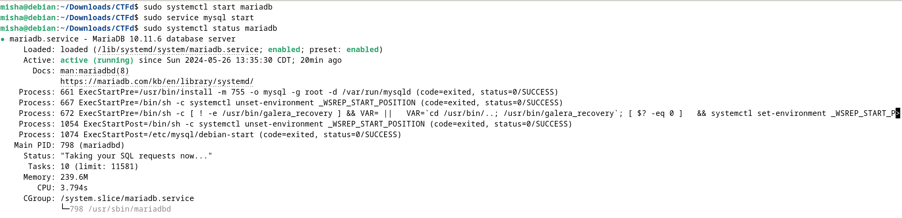
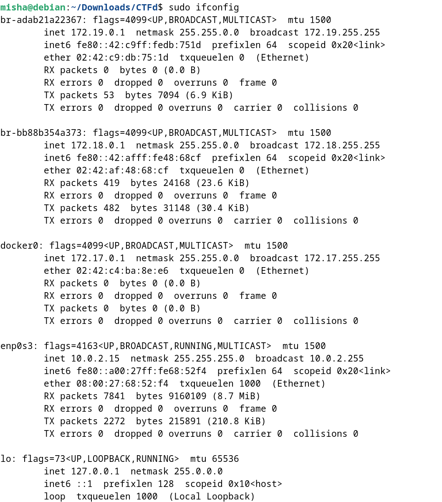
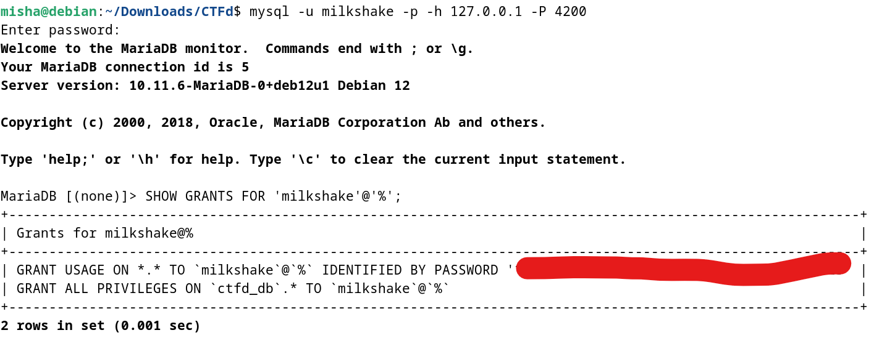
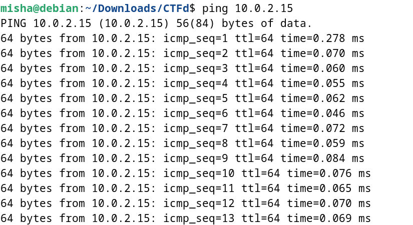
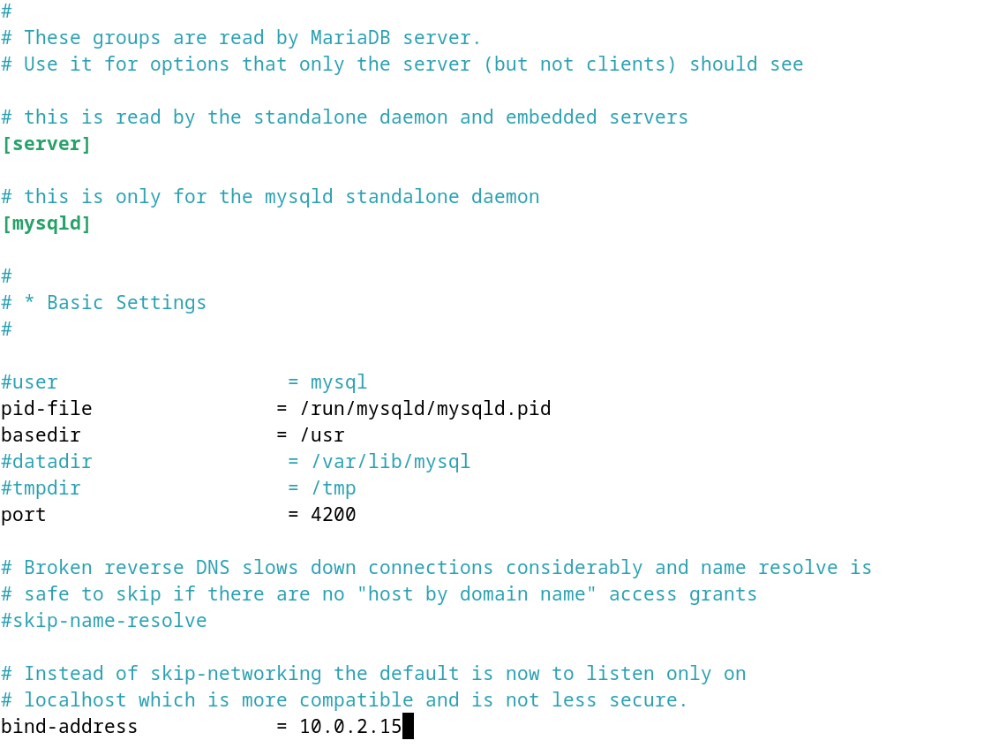
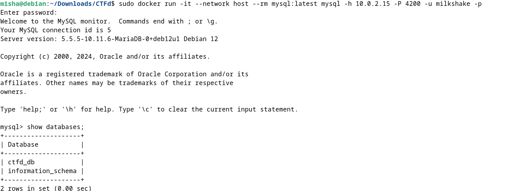
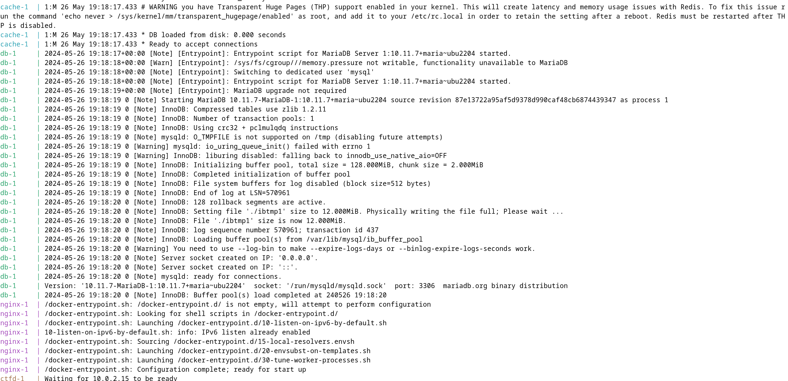

# 04-ctfd-yml

-   Host locally using docker compose
-   Use external DB

Okay, full disclosure, I mainly followed Azure's github repo for this cause I was facing a bunch of problems doing it myself.

- `sudo systemctl start mariadb`
- `sudo service mysql start`
- `sudo systemctl status mariadb`

- `hostname -i`

- `sudo ifconfig` (cause ifconfig doesn't work for some reason)

- `sudo mysql -u root -p`
- `CREATE DATABASE ctfd_db;`
- `CREATE USER 'milkshake'@'%' IDENTIFIED BY 'xxxx';`
- `GRANT ALL PRIVLEGES ON ctfd_db.* TO 'milkshake'@'%';`
- `FLUSH PRIVILEGES;`
- `mysql -u milkshake -p -h 127.0.0.1 -P 4200`
- `SHOW GRANTS FOR 'milkshake'@'%';`

- `ping 10.0.2.15`

- `sudo nano /etc/mysql/mariadb.conf.d/50-server.cnf`

- `sudo docker run -it --network host --rm mysql:latest mysql -h 10.0.2.15 -P 4200 -u milkshake -p`

I editted the docker-compose.yml file.

- `sudo docker compose up`

This allowed me to boost up the UI.