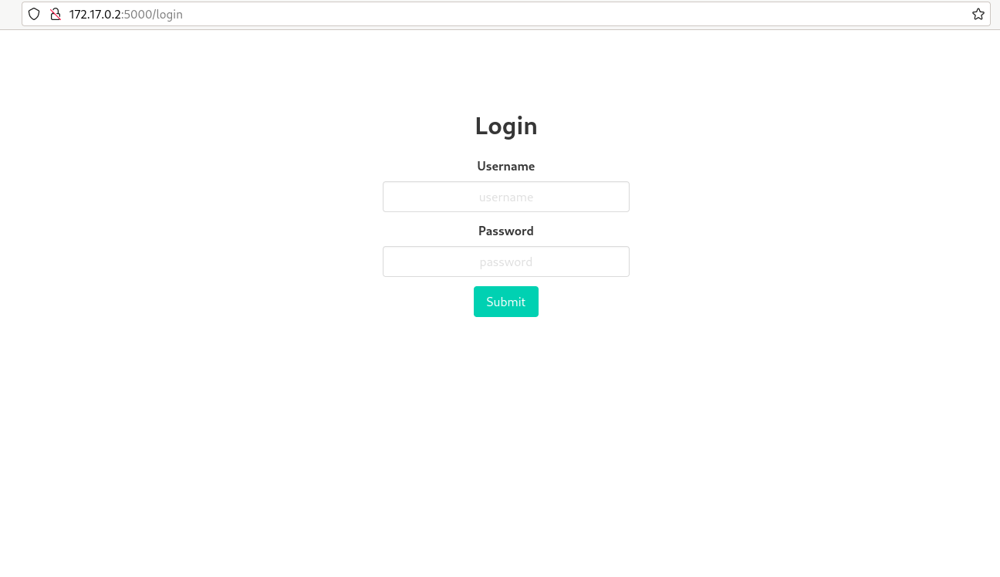

# 05-chal-dockerization-web

<h2>CTFd Challenge Dockerization</h2>

This repository contains the Docker configuration for challenge_to_dockerize.

<h2>Prerequisites</h2>

- Docker
- Docker Compose

## Getting Started

1. Build the Docker image:

    ```sh
    docker compose build
    ```

2. Run the container:

    ```sh
    docker compose up
    ```

<p align = 'center'>



</p>

(Ok so note: My docker container runs during the build process. Like docker compose build and docker compose up give the same results and I don't understand why.)

<h2>The 12 Factor App Methodology:</h2>

1. Codebase: One codebase tracked in revision control, many deploys. The Dockerfile copies the application code into the Docker image using `COPY . /app`, ensuring there's just one codebase.

2. Dependencies: Explicitly declare and isolate dependencies. The `RUN pip install --no-cache-dir -r requirements.txt` command installs the Python dependencies declared in the `requirements.txt` file.

3. Config: Store configuration in the environment. The `ENV` commands at the beginning of the Dockerfile and `environment` in docker-compose.yml set environment variables for configuration.

4. Backing services: Treat backing services as attached resources. The SQLite databse is treated as an attached resource, connecting it via a file path configured using the environment variable `DATABASE_URL=/tmp/app.db`.

5. Build, release, run: Strictly separate build and run stages. Okay honestly, I tried my hardest to separate the build and run stages. I think the Dockerfile does reflect separate build and run stages. However, somehow, the docker image runs during the build stage.

<p align = 'center'>


</p>

6. Processes: Execute the app as one or more stateless processes. The application is run as a stateless process by Gunicorn.

7. Port binding: Export services via port binding. The Dockerfile exposes a port for the application to be accessed using `EXPOSE $PORT`, and this port is mapped to a port on the host in the docker-compose.yml file (`ports`).

8. Concurrency: Scale out via the process model. The use of Gunicorn allows for easy scaling of worker processes.

9. Disposability: Maximize robustness with fast startup and graceful shutdown. Gunicorn helps ensure the application starts quickly and shuts down gracefully.

10. Dev/prod parity: Keep development, staging, and production as similar as possible. Using Docker helps ensure that the application runs in the same environment in all stages.

11. Logs: Treat logs as event streams. Docker handles this by default, capturing output to `stdout` and `stderr` and treating it as log output.

12. Admin processes: Run admin/management tasks as one-off processes. The `RUN python3 -c 'from app import init_db; init_db()'` command is an example of a one-off admin process to initialize the database.

<h2>Expected best practices for `Dockerfile`:</h2>

-   `.db` files must not be included in the challenge source. As far as possible; pre-existing data if any should be manually populated via the Dockerfile or a startup script
-   ANY SORT OF DISK WRITE, whether an image file or writing into a `.db` must be done at `/tmp` or similar ephermal, non-sensitive location. The challenge folder inside the docker container would usually be mounted read-only
-   At the end of docker script (Dockerfile), before starting the web server, drop the user privileges to those of some user lesser than root which is the default current user
-   For production chal instance docker files:
    -   nodejs type: use `node` as the web server
    -   python flask/fastapi/django type: use `gunicorn` as the web server, also look into `uvicorn`, include multiple workers
    -   any other type: `nginx` preferred
-   Strive to minimize the size of the docker image generated from your file
    -   Larger files take longer to upload and can even cost more
    -   How?
        -   use lighter version of the base image in the `FROM` statement
        -   delete cache files or supply arguments to package installers to prevent creating them altogether
-   Say NO to `RUN pip install x y z` or `RUN npm install x y z` cluttered JUNK. Say yes to `requirements.txt` and `RUN npm install`

<h2>Expected best practices for `docker-compose.yml`:</h2>

-   Convert **every single** variable that's prone to modification while deploying into an environment variable. Be sure to include a default value for it in case it's started the `python3 app.py` way w/o any envvars set. E.g. of such vars
    -   flag
    -   listening port of server
    -   title of challenge
    -   etc
    -   baseurl of out challenge server; in case the server needs to check that url submitted to bot is not `<some foreign un-related website a nefarious player is trying to DOS>`
-   Port mapping

<h2>Practices I Used</h2>

- Using a lightweight base image like python:3.12-slim-bookworm.
- Installing dependencies without caching to save space.
- Defining variables in the `docker-compose.yml` file for easy configuration.
- Running the application as a non-root user to enhance security.
- Using `requirements.txt` for dependencies to keep the Dockerfile clean and maintainable.
- Using Gunicorn as the web server with multiple workers for better performance.

<h2>Commonly used variants of docker base images and explain when to use which</h2>

- <b>`node` vs `debian`:</b>
    
    - The node image is mainly used when working with Node.js applications, as it comes pre-installed with Node.js and npm. It's based on the Devian operating system and includes all of the libraries and tools that are commonly associated with Node.js.

    - The debian image can mainly be used for general-purpose applications. However, its larger than some of the other images. It can be used when you need to install a lot of system packages, or if you're developing an application that requires a full-featured operating system.

- <b>`python:3.12-slim-bookworm` vs `python:3-alpine3.12`:</b>

    - The python:3.12-slim-bookworm is based on Debian 11. The slim variant is a minimal version that excludes some common libraries and utilities to keep the image size small. This might be used if the application requires certain libraries in Debian, or if a feature-rich environment is needed.

    - The python:3-alpine3.12 image is based on Alpine Linux 3.12. This is a good choice to minimize the docker image as much as possible, and if you can manage with fewer built-in libraries and utilities.

- <b>`ubuntu` vs `alpine`:</b>

    - The `ubuntu` base image is one of the most popular choices due to its ease of use and wide community support. They come with pre-installed libraries to run complex applications. Uses the `apt` package manager.

    - The `alpine` base image is lightweight, for faster deployment and lower resource usage. Uses the `apk` package manager.

<h2>`COPY` vs `ADD`</h2>

- `COPY` copies files and directories from the host to the container.
- `ADD` can do everything COPY does but also supports URL downloads and extracting TAR files. Use `COPY` when you don't explicitly need the features of `ADD`.

<h2>`RUN` vs `CMD` vs `ENTRYPOINT`</h2>

- `RUN` executes commands in a new layer and is used to install software packages. Executes during the build stage. Does not invoke a command shell. Used typically for setup tasks.
- `CMD` provides default commands or arguments for the entrypoint. Defaults for an executing container. May include or exclude the executable, in which case, `ENTRYPOINT` will need to be used. 
- `ENTRYPOINT` sets the command that will always be executed when the container starts.

- Example:
```dockerfile
ENTRYPOINT ["gunicorn"]
CMD ["--bind", "0.0.0.0:8000", "app:app"]
```

- IMPORTANT: Give a practical example of why someone would use multiple `FROM` statements in a SINGLE `Dockerfile`.

[You are welcome](https://pypi.org/project/pipreqs/)
[You are welcome](https://docs.docker.com/develop/dev-best-practices/)